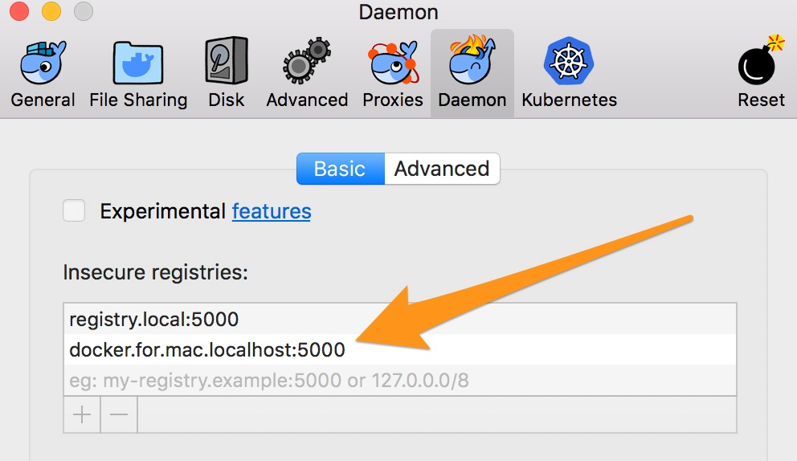
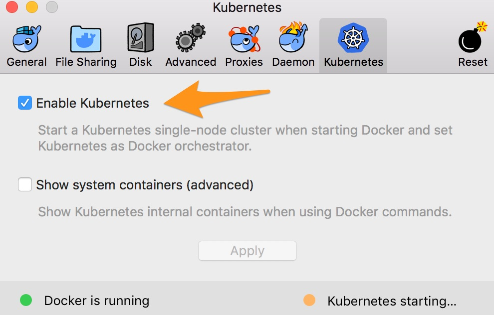

# Part 1 - Kubernetes in Docker for Mac and Docker for Windows

We'll start by getting Kubernetes running on your Mac on Windows machine. Docker for Mac and Docker for Windows provide a complete single-node certified Kubernetes environment. You can use all the usual Kubernetes objects - services, deployments, persistent volumes - and all the usual Kube tools - like `kubectl` and Helm - and you can also deploy Docker Compose files as stacks running in Kubernetes.

## Goals

* Run Kubernetes with Docker for Mac or Docker for Windows
* Deploy and manage stateless and stateful applications
* Deploy apps to Kubernetes using Kube manifests and Docker Compose files
* Deploy and use a local Docker Registry using Helm

## Steps

* [1. Deploy Kubernetes](#1)
* [2. Run stateless applications as deployments and stacks](#2)
* [3. Run a stateful service with a persistent volume](#3)
* [4. Run a local Docker Registry using Helm](#4)

## <a name="1"></a> Deploy Kubernetes

Kubernetes support in Docker for Mac and Docker for Windows is currently in beta, so you need to be running the latest Edge version. In this section you'll install and deploy Kubernetes on your laptop.

### 1.1 - Install Docker

Install [Docker for Mac](https://store.docker.com/editions/community/docker-ce-desktop-mac) or [Docker for Windows](https://store.docker.com/editions/community/docker-ce-desktop-windows).

> Make sure you select the **Edge** release channel. Kubernetes in Docker for Mac & Windows is currently a beta feature.

### 1.2 - Install Tools

We'll also use a couple of tools in this part of the workshop, which you'll need to install if you don't already have them - [jq](https://stedolan.github.io/jq/) and [Helm](https://helm.sh).

> On Mac you can install these with [Homebrew](https://brew.sh):

```
brew install jq
brew install kubernetes-helm
```

> On Windows you can install them with [Chocolatey](https://chocolatey.org):

```
choco install jq
choco install kubernetes-helm
```

### 1.3 - Configure Docker

We'll run a local Docker Registry in Kubernetes during the workshop. The registry uses HTTP so we need to add it to Docker's insecure registry list.

> On Mac open _Preferences...Daemon_ and add `docker.for.mac.localhost:5000` as an insecure registry:



> On Windows open _Settings...Daemon_ and add `docker.for.win.localhost:5000` as an insecure registry.

### 1.4 - Setup Kubernetes

Kubernetes is an optional feature in Docker for Mac and Docker for Windows. Docker downloads images and runs Kubernetes containers when you enable the feature.

> On Docker for Mac open _Preferences...Kubernetes_ and select _Enable Kubernetes_:



> On Docker for Windows first make sure you are in Linux containers mode. Then open _Settings...Kubernetes_ and select _Enable Kubernetes_.

You will see that Kubernetes is starting. It will take a few minutes to download and run all the components. When the Kubernetes and Docker lights are both green, you have Kubernetes running on your laptop, powered by the latest Docker engine!

> Updating Docker will update Kubernetes. Right now it's at 1.9.6.

### 1.5 - Verify Kubernetes

Docker also installs the `kubectl` command line, and sets the context to your local cluster. You can check the installation is OK using the command line:

```
kubectl version

kubectl get all
```

The Docker client can deploy applications as stacks to Kubernetes or to Docker Swarm. You configure the Docker CLI to switch between Kubernetes or Swarm by using the `DOCKER_ORCHESTRATOR` environment variable. The current mode is displayed with `docker version`:

```
docker version -f '{{ .Client.Orchestrator }}'
```

## <a name="2"></a> 2. Run stateless applications as deployments and stacks

You now have a full Kubernetes deployment running, with the API server, etcd and controllers all running in containers. In this section you'll run containerized applications as Kubernetes deployments and as Docker stacks.

### 2.1 - Run Nginx as a load-balanced Kubernetes deployment

First run a simple load-balanced Nginx web server, defined as a Kubernetes manifest in [nginx-deployment.yaml](part-1/nginx-deployment.yaml):

```
kubectl apply -f ./part-1/nginx-deployment.yaml

kubectl get all
```

The deployment creates two pods each running a single Nginx container, and a service of type `LoadBalancer` which maps port `8081` on the host to the pod port `80`. Docker for Mac and Windows creates a software load balancer which receives traffic on the host and distributes it to the pods.

> Browse to [localhost:8081](http://localhost:8081) to see Nginx running.

Or use `curl`:

```
curl http://localhost:8081
```

To prove that the load-balancer is really distributing traffic between the pods, we can change the HTML content on one of the pods.

First get the pod name and exec into a shell session on the first pod:

```
pod=$(kubectl get pods -o json | jq -r '.items[0].metadata.name')

kubectl exec -it $pod sh
```

Now replace the content of the Nginx home page:

```
echo '<h1>This is v3</h1>' > /usr/share/nginx/html/index.html

exit
```

Refresh your browser (using cmd-R or control-F5 to avoid the browser cache), and you will sometimes see the original Nginx page and other times see the new content.

You can also use `curl` with a zero keep-alive to see the different responses from the containers:

```
curl --keepalive-time 0 http://localhost:8081
```

> Docker uses a custom controller to create a load balancer service, in the same way that cloud providers use their own load balancer products.

### 2.2 - Run Nginx as a load-balanced Docker stack on Kubernetes

You can run the same application on Kubernetes using a Docker Compose file instead of a Kubernetes manifest. Next we'll deploy Nginx using the [nginx2-compose.yaml](part-1/nginx2-compose.yaml) file.

First make sure your Docker client is configured to use Kubernetes as the orchestrator:

```
docker version -f '{{ .Client.Orchestrator }}'
```

> You can switch orchestrators with the `DOCKER_ORCHESTRATOR` environment variable, setting it to `kubernetes` or `swarm`.

Now deploy the application as a Docker stack to Kubernetes:

```
docker stack deploy -c ./part-1/nginx2-compose.yaml nginx2
```

Docker generates a Kubernetes manifest from the Docker Compose file and creates is as a deployment. You can manage the top-level stack using Docker, and the lower-level Kubernetes objects using `kubectl`:

```
docker stack ls

kubectl get deployments
```

This deployment also creates two pods each running a single Nginx container, and a service of type `LoadBalancer`. This version maps port `8082` on the host to the pod port `80`.

> Browse to [localhost:8082](http://localhost:8082)

And use `curl` to check the Nginx version:

```
curl -v http://localhost:8082
```

### 2.3 - Patch the Kubernetes deployment to upgrade Nginx

The Docker stack deployment is using an older version of Nginx. To update the pod definition you can either deploy a new stack definition, or you can patch the existing Kubernetes deployment.

The file [nginx2-patch.yaml](part-1/nginx2-patch.yaml) contains a spec update which will upgrade the pods in the stack to the latest version of Nginx.

Deploy the patch with `kubectl`:

```
kubectl patch deployment nginx2 --patch "$(cat ./part-1/nginx2-patch.yaml)"
```

When the deployment completes, use curl to check the Nginx version:

```
curl -v http://localhost:8082
```

### 2.4 - Run Nginx as a load-balanced Docker stack on Docker swarm

In the next part of the workshop you'll be using a Docker EE cluster, which runs multiple orchestrators - you can run apps in Docker swarm and in Kubernetes **on the same cluster**.

Docker for Mac and Docker for Windows also support running Docker swarm and Kubernetes side-by-side. You can initialize a single-node swarm and run a third Nginx deployment as a Docker swarm stack.

First you need to initialize the swarm, if you're not already running in swarm mode, and switch to `swarm` as the orchestrator for the Docker client:

```
docker swarm init

export DOCKER_ORCHESTRATOR=swarm
```

Now deploy Nginx using the Docker Compose file [nginx3-compose.yaml](part-1/nginx3-compose.yaml):

```
docker stack deploy -c ./part-1/nginx3-compose.yaml nginx3
```

This is the same app definition as the other deployments, just using a different port - so now you have Nginx running as a Kubernetes deployment using port `8081`, as a Docker stack on Kubernetes using port `8082`, and as a Docker stack on swarm using port `8083`.

> Browse to [localhost:8083](http://localhost:8083)

And check the Nginx version using `curl`:

```
curl -v http://localhost:8083
```

All the apps are running as containers on the same Docker engine, two of them as Docker stacks and the third as a Kubernetes deployment. You can view them all with the Docker command line:

```
docker stack ls

docker container ls
```

### 2.5 - Clean up

You're still using swarm as the client orchestrator, and you can remove the latest app by removing the stack:

```
docker stack rm nginx3
```

The second app is also a stack, so you can switch the client orchestrator to Kubernetes and remove the stack in the same way:

```
export DOCKER_ORCHESTRATOR=kubernetes

docker stack rm nginx2
```

> Removing a Kubernetes stack in Docker removes **all** the Kubernetes objects

```
kubectl get all
```

The first app was a native Kube deployment, so you need to remove it using `kubectl`. Kubernetes leaves the service in place when you delete the deployment, so you need to also manually remove the service:

```
kubectl delete deployment nginx-deployment

kubectl delete svc nginx
```

## <a name="3"></a> 3. Run a stateful service with a persistent volume

Your local Kubernetes cluster running on Docker supports persistent volumes, which write to a path on your host OS. In this section you'll run MySQL in Kubernetes with a persistent volume, then remove and replace the deployment to see that your original data is still there.

### 3.1 - Deploy MySQL with a persistent volume

The deployment manifest [mysql-deployment.yaml](part-1/mysql-deployment.yaml) creates a persistent volume claim and a service, and runs MySQL in a pod using a volume mapped to the persistent volume claim.

Deploy the MySQL instance:

```
kubectl apply -f ./part-1/mysql-deployment.yaml
```

You can use the output from `kubectl` to show the host path of the persistent volume, which will be a path on your laptop OS. That path stores all the data files that MySQL writes to the path `/var/lib/mysql` inside the container:

```
path=$(kubectl get pv -o json | jq -r '.items[0].spec.hostPath.path')

cd $path

ll
```

Connect to the MySQL database by running an interactive container, and use the MySQL client to create a new user:

```
kubectl run -it --rm --image=mysql:8.0.11 --restart=Never mysql-client -- mysql -h mysql -ppassword

CREATE USER 'k8s'@'localhost' IDENTIFIED BY 'kubernetes';
```

### 3.2 - Recreate MySQL

The persistent volume has its own lifecycle, outside of the container and pod lifecycles. You can delete the deployment and recreate it - which will run a new MySQL instance, attaching to the original volume for storage:

```
kubectl delete deployment mysql

kubectl apply -f ./part-1/mysql-deployment.yaml
```

Run another interactive container, and you can check that the user you created using the previous deployment is still there in the database:

```
kubectl run -it --rm --image=mysql:8.0.11 --restart=Never mysql-client -- mysql -h mysql -ppassword

SELECT User FROM mysql.user;
```

### 3.3 - Clean up

Remove the deployment, the service, and the persistent volume claim:

```
kubectl delete deployment mysql

kubectl delete service mysql

kubectl delete pvc mysql-pv-claim
```

## <a name="4"></a> 4. Run a local Docker Registry using Helm

You can make use of Helm to deploy complex applications on your desktop Kubernetes cluster. In this section you'll initialize Helm and use it to deploy a local Docker Registry.

### 4.1 - Initialize Helm and Tiller

First you need to set your Helm home path, using an environment variable.

> On Mac run `export HELM_HOME=~/helm`

> On Windows run `$env:HELM_HOME=$(~/helm)`

Then initialize Helm, which deploys the Tiller back-end to Kubernetes, using the `kube-system` namespace:

```
helm init --debug

kubectl get svc -n kube-system
```

### 4.2 - Deploy the Docker Registry

Now you can use Helm to deploy a local registry, using the open-source [Docker Registry](https://docs.docker.com/registry/). This configuration exposes a load balancer for the registry, and uses a persistent volume fort storage:

```
helm install --name registry \
 --set service.type=LoadBalancer \
 --set persistence.enabled=true \
 stable/docker-registry
```

### 4.3 - Push an image to the local registry

When the application deploys, the Docker Registry API will be listening on port `5000` on your host. You can check the API using `curl`:

```
curl http://localhost:5000/v2/_catalog
```

And you can tag and push images to the registry. Remember that your Linux Docker engine is running in a VM on Docker for Mac or Docker for Windows, so you need to use the `docker.for.***.localhost` domain for the registry - which we added to the insecure registries list at the beginng of the workshop.

First store the registry address in an environment variable, to make it easier to work with.

> On Mac run `export REGISTRY_DOMAIN=docker.for.mac.localhost`

> On Windows run `$env:=REGISTRY_DOMAIN=docker.for.win.localhost`

Now pull a nice small image to use, and tag it with your domain and a new repository name:

```
docker image pull alpine:3.7

docker image tag alpine:3.7 $REGISTRY_DOMAIN:5000/my-alpine:gold
```

You can push the image now, and when you repeat the API call to the registry, you will see the new repository exists:

```
docker image push $REGISTRY_DOMAIN:5000/my-alpine:gold

curl http://localhost:5000/v2/_catalog
```

### 4.4 - Clean up

Use Helm to remove the deployment, optionally with the `purge` flag to remove all traces:

```
helm delete --purge registry
```

That also removes the persistent volume for the registry, so your cluster should be back to its initial state.

## Up Next

On to [Part 2](./part-2.md) where we'll move onto Kubernetes in Docker Enterprise Edition.
